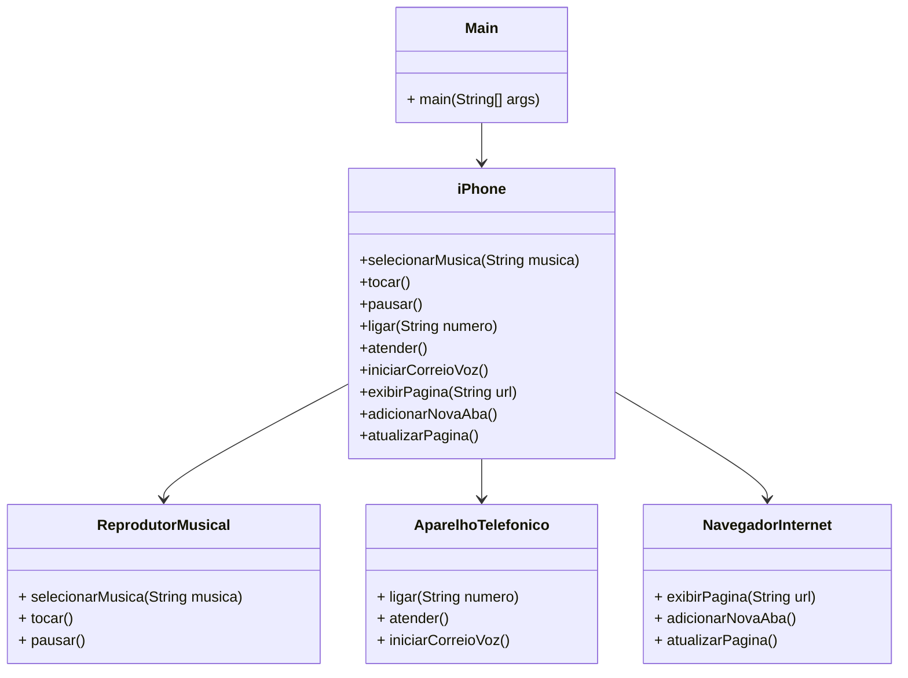

# 📱 Simulador iPhone 2007 - Programação Orientada a Objetos (POO)
Realizando um desafio do bootcamp santander 2025 em parceria com a DIO: "Modelando o iPhone com UML: Funções de Músicas, chamadas e Internet".

Coloquei em prática toda a concepção de análise de negócios, requisitos, conceitos da programação orientada a objetos e modelagem UML. Com base no vídeo de lançamento do iPhone conforme o [link](https://www.youtube.com/watch?v=9ou608QQRq8).

## 🔄 Funcionalidades Implementadas

### Reprodutor Musical
- Selecionar uma música.
- Tocar uma música.
- Pausar  uma música.

### Aparelho Telefônico
- Ligar para um número telefônico.
- Atender um número telefônico.
- Iniciar um correio de voz.

### Navegador na Internet
- Exibir Página com uma URL.
- Adicionar uma nova aba.
- Atualizar página.

---

## 📊 Diagrama UML do Sistema

